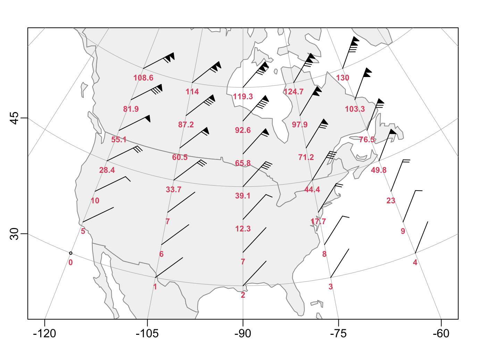

This is a test repo, to save some hassles with uploading code to
https://github.com/dankelley/oce/issues/2191

How to use it:

1. Clone the repo.  When you want to update code later, pull the repo again.
   There are lots of ways to clone and pull, so I won't enumerate any
   particular ones.

2. If you're on a unix-type machine, type `make` to run the test, and see if
   the created `.png` file looks sensible.

Below is what I have with the present version of the code:

